## 说明

这份指南有2016版和2020版（即此文）两个版本，主要的一些改动如下（此外就是对提到的书籍、课程等资源进行了更新）：

??? note "改动记录"

    - 前言部分：
      - 新增一节 “Still too much?”
    - Programming
      - 新增 61A taught by John DeNero, [Composing Programs](https://composingprograms.com/)
      - 删除：[Concepts, Techniques, and Models of Computer Programming](https://smile.amazon.com/Concepts-Techniques-Models-Computer-Programming/dp/0262220695/).
    - 计算机体系结构 Computer Architecture
      - 新增：[Computer Systems: A Programmer's Perspective](http://csapp.cs.cmu.edu/3e/home.html)
    - 操作系统 Operating Systems
      - 新增 [Linux Kernel Development](https://www.amazon.com/Linux-Kernel-Development-Robert-Love/dp/0672329468).
    - 计算机网络 Computer Networking
      - 删除 [mini TCP stack](http://jvns.ca/blog/2014/08/12/what-happens-if-you-write-a-tcp-stack-in-python/),
    - 数据库 Databases
      - 删除：关于CS 186课程中新增Spark，以及学习关系型数据库的一段讨论。
    - 编程语言和编译器 Languages and Compilers
      - 新增：[Crafting Interpreters](https://craftinginterpreters.com/contents.html)
      - 删除：[Language Implementation Patterns](https://smile.amazon.com/Language-Implementation-Patterns-Domain-Specific-Programming/dp/193435645X/)
      - 删除：[Make a Lisp](https://github.com/kanaka/mal)
    - 分布式系统 Distributed Systems
      - 新增：[Designing Data-Intensive Applications](https://smile.amazon.com/Designing-Data-Intensive-Applications-Reliable-Maintainable-ebook/dp/B06XPJML5D/)
    - 常见问题解答 Frequently asked questions
      - 调整顺序（有部分文字改动）：“Who is the target audience for this guide?”
      - 新增一节“Why are you still recommending SICP?”

相关中文译文，可参见Wu Zhengke（Zack Wu）翻译
[TeachYourselfCS-CN](https://github.com/izackwu/TeachYourselfCS-CN/blob/master/TeachYourselfCS-CN.md)，
主要综合2016版和2020版内容，补充和更新了一些对应中文资料和书籍图片。

??? note "中文注释"

    【编程 Programming】部分
    **中文翻译新增：**
    
    - 关于 SICP 国内视频观看地址
      - [MIT 的免费视频课程（中英字幕）](https://www.bilibili.com/video/av8515129/)
      - [Brian Harvey 开设的 SICP 课程（英文字幕）](https://www.bilibili.com/video/av40460492/)
    - Scheme 学习的相关资源参见：<https://github.com/DeathKing/Learning-SICP>
    - 更详细的补充说明：[#3](https://github.com/izackwu/TeachYourselfCS-CN/issues/3)
    
    【常见问题解答 Frequently asked questions】部分
    **中文翻译新增：**
    
    事实上，比起美国，在国内购买技术书籍可以说是相当「廉价」了。
    如果仍旧寻求更加便宜的购买渠道，可以参考这篇 V2EX 上的 [讨论帖子](https://www.v2ex.com/t/578615)，
    其中提到了一些不错的购买渠道。

其他参考指南：

- [仲殷旻](https://github.com/PKUFlyingPig)创建的[CS自学指南](https://csdiy.wiki)
- Open Source Society创建的指南[computer-science](https://github.com/open-source-society/computer-science)，
  - 中文版[computer-science-cn](https://github.com/ossu/computer-science-cn)

---

## Teach Yourself Computer Science

**Note: this guide was extensively updated in May 2020. For the prior
version, *see here*.**

If you’re a self-taught engineer or bootcamp grad, you owe it to
yourself to learn computer science. Thankfully, you can give yourself a
world-class CS education without investing years and a small fortune in
a degree program 💸.

There are plenty of resources out there, but some are better than
others. You don’t need yet another “200+ Free Online Courses” listicle.
You need answers to these questions:

- **Which subjects** should you learn, and why?
- What is the **best book or video lecture series** for each subject?

This guide is our attempt to definitively answer these questions.

Thank you to the following volunteers for translations:

- [中文翻译见此](https://github.com/keithnull/TeachYourselfCS-CN/blob/master/TeachYourselfCS-CN.md)
  (Chinese) by Wu Zhengke
- [Tradução em
  português](https://github.com/Clemensss/TeachYourselfCS-PT/blob/master/TeachYourselfCS-PT.md)
  (Portugese) by Clemens Schrage
- [Перевод на
  Русском](https://github.com/ilmoi/teachyourselfCS-RU/blob/master/Teach_yourself_cs-2020-RU.md)
  (Russian) by Ilja Moisejevs and Stepan Rakitin
- [Bản dịch tiếng
  Việt](https://github.com/htdat/TeachYourselfCS-vi/blob/main/README.md)
  (Vietnamese) by Dat Hoang
- [Traducción en Español
  (Latinoamerica)](https://github.com/jamesleeat/TeachYourselfCS-ES/blob/main/TeachYourselfCS-ES.md)
  (Spanish) by James Archbold
- [컴퓨터과학 스스로
  학습하기](https://github.com/minnsane/TeachYourselfCS-KR/blob/main/README.md)
  (Korean) by Minjeong Kim
- [日本語に翻訳](https://github.com/ralphplumley/TeachYourselfCS-JP/blob/main/%E6%97%A5%E6%9C%AC%E8%AA%9E.md)
  (Japanese) by Ralph Plumley
- [Türkçe
  çevirisi](https://github.com/tolgabp/TeachYourselfCS-TR/blob/main/TeachYourselfCS-TR.md)
  (Turkish) by Tolga Barış Pınar
- [ﺗﺮﺟﻤﻪ ﺭﺍﻫﻨﻤﺎ ﺑﻪ
  ﻓﺎﺭﺳﯽ](https://github.com/F4R4N/TeachYourselfCS-FA/blob/main/TeachYourselfCS-FA.md)
  (Persian) by Faran Taghavi
- [Traduzione in
  Italiano](https://github.com/fabiocicerchia/TeachYourselfCS-IT/blob/main/TeachYourselfCS-IT.md)
  (Italian) by Fabio Cicerchia
- [Traduction en
  français](https://github.com/ChocolateCharlie/TeachYourselfCS-FR/blob/main/TeachYourselfCS-FR.md)
  (French) by Aurore Amrit
- [Terjemahan bahasa
  Indonesia](https://github.com/zweimach/TeachYourselfCS-ID)
  (Indonesian) by Ananda Umamil
- [الترجمة
  العربية](https://github.com/ounissi-zakaria/TeachYourselfCS-AR/blob/main/TeachYourselfCS-AR.md)
  (Arabic) by Ounissi Zakaria
- [Переклад
  українською](https://github.com/oleksbabieiev/TeachYourselfCS-UK/blob/master/TeachYourselfCS-UK.md)
  (Ukranian) by Oleksandr Babieiev
- [Deutsche
  Übersetzung](https://github.com/AhmedOmran0/TeachYourselfCS-DE/blob/main/TeachYourselfCS-DE.md)
  (German) by Ahmed Omran
- [Кыргызча
  котормо](https://github.com/tavigul/teachyourselfCS-KG/blob/main/Teach_yourself_cs-2020-KG.md)
  (Kyrgyz) by Tavita Menashe
- [O'zbek tiliga
  tarjima](https://github.com/MansurIsakov/teachyourselfCS-UZ/blob/main/teach-yourself-CS-2020-UZ.md)
  (Uzbek) by Mansur Isakov
- [Polskie
  tłumaczenie](https://wiktor-rocks.github.io/TeachYourSelfCS-PL/)
  (Polish) by Wiktor Wieczorkiewicz

## TL;DR

Study all nine subjects below, in roughly the presented order, using
either the suggested textbook or video lecture series, but ideally both.
Aim for 100-200 hours of study of each topic, then revisit favorites
throughout your career 🚀.

| Subject                                                               | Why study?                                                                                                                                       | Book                                                        | Videos                            |
| --------------------------------------------------------------------- | ------------------------------------------------------------------------------------------------------------------------------------------------ | ----------------------------------------------------------- | --------------------------------- |
| **[Programming](#programming)**                                       | Don’t be the person who “never quite understood” something like recursion.                                                                       | *Structure and Interpretation of Computer Programs*         | Brian Harvey’s Berkeley CS 61A    |
| **[Computer Architecture](#computer-architecture)**                   | If you don’t have a solid mental model of how a computer actually works, all of your higher-level abstractions will be brittle.                  | *Computer Systems: A Programmer's Perspective*              | Berkeley CS 61C                   |
| **[Algorithms and Data Structures](#algorithms-and-data-structures)** | If you don’t know how to use ubiquitous data structures like stacks, queues, trees, and graphs, you won’t be able to solve challenging problems. | *The Algorithm Design Manual*                               | Steven Skiena’s lectures          |
| **[Math for CS](#mathematics-for-computer-science)**                  | CS is basically a runaway branch of applied math, so learning math will give you a competitive advantage.                                        | *Mathematics for Computer Science*                          | Tom Leighton’s MIT 6.042J         |
| **[Operating Systems](#operating-systems)**                           | Most of the code you write is run by an operating system, so you should know how those interact.                                                 | *Operating Systems: Three Easy Pieces*                      | Berkeley CS 162                   |
| **[Computer Networking](#computer-networking)**                       | The Internet turned out to be a big deal: understand how it works to unlock its full potential.                                                  | *Computer Networking: A Top-Down Approach*                  | Stanford CS 144                   |
| **[Databases](#databases)**                                           | Data is at the heart of most significant programs, but few understand how database systems actually work.                                        | *Readings in Database Systems*                              | Joe Hellerstein’s Berkeley CS 186 |
| **[Languages and Compilers](#languages-and-compilers)**               | If you understand how languages and compilers actually work, you’ll write better code and learn new languages more easily.                       | *Crafting Interpreters*                                     | Alex Aiken’s course on edX        |
| **[Distributed Systems](#distributed-systems)**                       | These days, *most* systems are distributed systems.                                                                                              | *Designing Data-Intensive Applications* by Martin Kleppmann | MIT 6.824                         |

## Still too much?

If the idea of self-studying 9 topics over multiple years feels
overwhelming, we suggest you focus on just two books: *Computer Systems:
A Programmer's Perspective* and *Designing Data-Intensive Applications*.
In our experience, these two books provide incredibly high return on
time invested, particularly for self-taught engineers and bootcamp grads
working on networked applications. They may also serve as a "gateway
drug" for the other topics and resources listed above.

## Why learn computer science?

[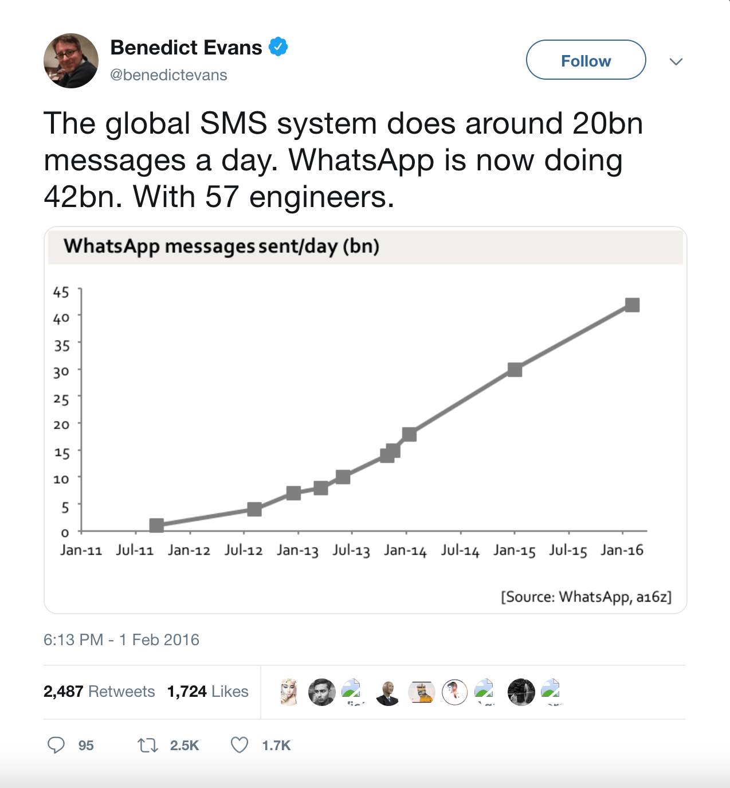](https://t.co/zZrtSIzhlR)

> The global SMS system does around 20bn messages a day. WhatsApp is now
> doing 42bn. With 57 engineers.
>
> — Benedict Evans (@BenedictEvans)
> [February 2, 2016](https://twitter.com/BenedictEvans/status/694342874729545729)

There are 2 types of software engineer: those who understand computer
science well enough to do challenging, innovative work, and those who
just get by because they’re familiar with a few high level tools.

Both call themselves software engineers, and both tend to earn similar
salaries in their early careers. But Type 1 engineers progress toward
more fulfilling and well-remunerated work over time, whether that’s
valuable commercial work or breakthrough open-source projects, technical
leadership or high-quality individual contributions.

Type 1 engineers find ways to learn computer science in depth, whether
through conventional means or by relentlessly learning throughout their
careers. Type 2 engineers typically stay at the surface, learning
specific tools and technologies rather than their underlying
foundations, only picking up new skills when the winds of technical
fashion change.

Currently, the number of people entering the industry is rapidly
increasing, while the number of CS grads is relatively static. This
oversupply of Type 2 engineers is starting to reduce their employment
opportunities and keep them out of the industry’s more fulfilling work.
Whether you’re striving to become a Type 1 engineer or simply looking
for more job security, learning computer science is the only reliable
path.

## Subject guides

### Programming

[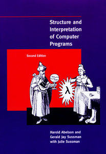](https://sarabander.github.io/sicp/html/index.xhtml)

Most undergraduate CS programs start with an “introduction” to computer
programming. The best versions of these courses cater not just to
novices, but also to those who missed beneficial concepts and
programming models while first learning to code.

Our standard recommendation for this content is the classic *Structure
and Interpretation of Computer Programs*, which is available online for
free both as
[a book](https://sarabander.github.io/sicp/html/index.xhtml),
and as a set of
[MIT video lectures](https://ocw.mit.edu/courses/6-001-structure-and-interpretation-of-computer-programs-spring-2005/video_galleries/video-lectures/).
While those lectures are great, our video suggestion is actually
[Brian Harvey’s SICP lectures](https://archive.org/details/ucberkeley-webcast-PL3E89002AA9B9879E?sort=titleSorter)
(for the 61A course at Berkeley) instead. These are more refined and
better targeted at new students than are the MIT lectures.

We recommend working through at least the first three chapters of SICP
and doing the exercises. For additional practice, work through a set of
small programming problems like those on
[exercism](http://exercism.io/).

Since this guide was first published in 2016, one of the most commonly
asked questions has been whether we’d now recommend recordings of a more
recent iteration of 61A taught by John DeNero, and/or the corresponding
book *[Composing Programs](https://composingprograms.com/)*, which is
“in the tradition of SICP” but uses Python. We think the DeNero
resources are also great, and some students may end up preferring them,
but we still suggest SICP, Scheme, and Brian Harvey’s lectures as the
first set of resources to try.

Why? Because SICP is unique in its ability—at least potentially—to alter
your fundamental beliefs about computers and programming. Not everybody
will experience this. Some will hate the book, others won't get past the
first few pages. But the potential reward makes it worth trying.

If you don't enjoy SICP, try *Composing Programs*. If that still doesn't
suit, try *[How to Design Programs](http://www.htdp.org/)*. If none of
these seem to be rewarding your effort, perhaps that's a sign that you
should focus on other topics for some time, and revisit the discipline
of programming in another year or two.

Finally, a point of clarification: this guide is NOT designed for those
who are entirely new to programming. We assume that you are a competent
programmer without a background in computer science, looking to fill in
some knowledge gaps. The fact that we've included a section on
"programming" is simply a reminder that there may be more to learn. For
those who've never coded before, but who'd like to, you might prefer a
guide like [this one](https://www.reddit.com/r/learnprogramming/wiki/faq#wiki_getting_started).

### Computer Architecture

[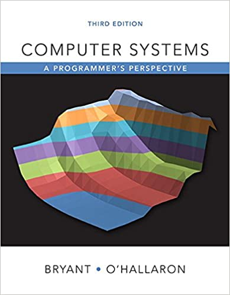](http://csapp.cs.cmu.edu/3e/home.html)

> **Hardware is the platform**
>
> – *Mike Acton, Engine Director at Insomniac Games*
> ([watch his CppCon talk](https://www.youtube.com/watch?v=rX0ItVEVjHc))

Computer Architecture—sometimes called “computer systems” or “computer
organization”—is an important first look at computing below the surface
of software. In our experience, it’s the most neglected area among
self-taught software engineers.

Our favorite introductory book is
*[Computer Systems: A Programmer's Perspective](http://csapp.cs.cmu.edu/3e/home.html)*,
and a typical introductory computer architecture course using the book
[would cover](http://csapp.cs.cmu.edu/3e/courses.html) most of chapters 1-6.

We love CS:APP for the practical, programmer-oriented approach. While
there's much more to computer architecture than what's covered in the
book, it serves as a great starting point for those who'd like to
understand computer systems primarily in order to write faster, more
efficient and more reliable *software*.

For those who'd prefer both a gentler introduction to the topic and a
balance of hardware and software concerns, we suggest
*The Elements of Computing Systems*, also known as “Nand2Tetris”.
This is an ambitious book attempting to give you a cohesive understanding of how everything
in a computer works. Each chapter involves building a small piece of the
overall system, from writing elementary logic gates in HDL, through a
CPU and assembler, all the way to an application the size of a Tetris
game.

We recommend reading through the first six chapters of the book and
completing the associated projects. This will develop your understanding
of the relationship between the architecture of the machine and the
software that runs on it.

The first half of the book (and all of its projects), are available for
free from [the Nand2Tetris website](http://www.nand2tetris.org/). It’s
also available as
[a Coursera course with accompanying videos](https://www.coursera.org/learn/build-a-computer).

In seeking simplicity and cohesiveness, Nand2Tetris trades off depth. In
particular, two very important concepts in modern computer architectures
are pipelining and memory hierarchy, but both are mostly absent from the
text.

Once you feel comfortable with the content of Nand2Tetris, we suggest
either returning to CS:APP, or considering Patterson and Hennessy’s
*[Computer Organization and Design](https://smile.amazon.com/Computer-Organization-Design-Fifth-Architecture/dp/0124077269)*,
an excellent and now classic text. Not every section in the book is
essential; we suggest following Berkeley’s
[CS61C course](http://inst.eecs.berkeley.edu/~cs61c/sp15/) “Great Ideas in
Computer Architecture” for specific readings. The lecture notes and labs
are available online, and past lectures are
[on the Internet Archive](https://archive.org/details/ucberkeley-webcast-PL-XXv-cvA_iCl2-D-FS5mk0jFF6cYSJs_).

### Algorithms and Data Structures

[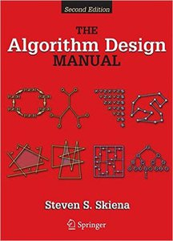](https://smile.amazon.com/Algorithm-Design-Manual-Steven-Skiena/dp/1848000693/)
[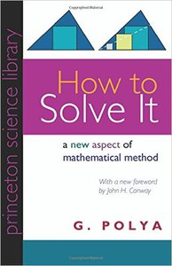](https://smile.amazon.com/How-Solve-Mathematical-Princeton-Science/dp/069116407X/)

> **I have only one method that I recommend extensively—it’s called think before you write.**
>
> — Richard Hamming

We agree with decades of common wisdom that familiarity with common
algorithms and data structures is one of the most empowering aspects of
a computer science education. This is also a great place to train one’s
general problem-solving abilities, which will pay off in every other
area of study.

There are hundreds of books available, but our favorite is
*[The Algorithm Design Manual](https://smile.amazon.com/Algorithm-Design-Manual-Steven-Skiena/dp/1848000693/)*
by Steven Skiena. He clearly loves algorithmic problem solving and
typically succeeds in fostering similar enthusiasm among his students
and readers. In our opinion, the two more commonly suggested texts (CLRS
and Sedgewick) tend to be a little too proof-heavy for those learning
the material primarily to help with practical problem solving.

For those who prefer video lectures,
[Skiena generously provides his online](https://www3.cs.stonybrook.edu/~skiena/373/videos/).
We also really like Tim Roughgarden’s course, available
[on Coursera](https://www.coursera.org/specializations/algorithms) and
[elsewhere](http://timroughgarden.org/videos.html). Whether you prefer
Skiena’s or Roughgarden’s lecture style will be a matter of personal
preference. In fact, there are dozens of good alternatives, so if you
happen to find another that you like, we encourage you to stick with it!

For practice, our preferred approach is for students to solve problems
on [Leetcode](http://leetcode.com/). These tend to be interesting
problems with decent accompanying solutions and discussions. They also
help you test progress against questions that are commonly used in
technical interviews at the more competitive software companies. We
suggest solving around 100 random leetcode problems as part of your
studies.

Finally, we strongly recommend
*[How to Solve It](https://smile.amazon.com/How-Solve-Mathematical-Princeton-Science/dp/069116407X/)*
as an excellent and unique guide to general problem solving; it’s as
applicable to computer science as it is to mathematics.

### Mathematics for Computer Science

> **If people do not believe that mathematics is simple, it is only
> because they do not realize how complicated life is.**
>
> — John von Neumann

In some ways, computer science is an overgrown branch of applied
mathematics. While many software engineers try—and to varying degrees
succeed—at ignoring this, we encourage you to embrace it with direct
study. Doing so successfully will give you an enormous competitive
advantage over those who don’t.

The most relevant area of math for CS is broadly called “discrete
mathematics”, where “discrete” is the opposite of “continuous” and is
loosely a collection of interesting applied math topics outside of
calculus. Given the vague definition, it’s not meaningful to try to
cover the entire breadth of “discrete mathematics”. A more realistic
goal is to build a working understanding of logic, combinatorics and
probability, set theory, graph theory, and a little of the number theory
informing cryptography. Linear algebra is an additional worthwhile area
of study, given its importance in computer graphics and machine
learning.

Our suggested starting point for discrete mathematics is the set of
[lecture notes by László Lovász](https://cims.nyu.edu/~regev/teaching/discrete_math_fall_2005/dmbook.pdf).
Professor Lovász did a good job of making the content approachable and
intuitive, so this serves as a better starting point than more formal
texts.

For a more advanced treatment, we suggest
*[Mathematics for Computer Science](https://courses.csail.mit.edu/6.042/spring17/mcs.pdf)*,
the book-length lecture notes for the MIT course of the same name. That
course’s video lectures are also
[freely available](https://ocw.mit.edu/courses/6-042j-mathematics-for-computer-science-fall-2010/video_galleries/video-lectures/),
and are our recommended video lectures for discrete math.

For linear algebra, we suggest starting with the
[Essence of linear algebra](https://www.youtube.com/playlist?list=PLZHQObOWTQDPD3MizzM2xVFitgF8hE_ab)
video series, followed by Gilbert Strang’s
[book](https://www.amazon.com/Introduction-Linear-Algebra-Gilbert-Strang/dp/0980232775/)
and [video lectures](https://ocw.mit.edu/courses/18-06sc-linear-algebra-fall-2011/).

### Operating Systems

[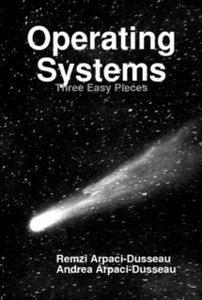](http://pages.cs.wisc.edu/~remzi/OSTEP/)

*[Operating System Concepts](https://www.amazon.com/dp/1118063333/)*
(the “Dinosaur book”) and
*[Modern Operating Systems](https://www.amazon.com/dp/013359162X/)*
are the “classic” books on operating systems. Both have attracted criticism for their lack of
clarity and general student unfriendliness.

*Operating Systems: Three Easy Pieces* is a good alternative that’s
[freely available online](http://pages.cs.wisc.edu/~remzi/OSTEP/).
We particularly like the structure and readability of the book, and feel
that the exercises are worthwhile.

After OSTEP, we encourage you to explore the design decisions of
specific operating systems, through “{OS name} Internals” style books
such as
*[Lion's commentary on Unix](https://www.amazon.com/Lions-Commentary-Unix-John/dp/1573980137/)*,
*[The Design and Implementation of the FreeBSD Operating System](https://www.amazon.com/Design-Implementation-FreeBSD-Operating-System/dp/0321968972/)*,
and *[Mac OS X Internals](https://www.amazon.com/Mac-OS-Internals-Systems-Approach/dp/0321278542/)*.
For Linux, we suggest Robert Love's fantastic
[Linux Kernel Development](https://www.amazon.com/Linux-Kernel-Development-Robert-Love/dp/0672329468).

A great way to consolidate your understanding of operating systems is to
read the code of a small kernel and add features. One choice is
[xv6](https://pdos.csail.mit.edu/6.828/2016/xv6.html), a port of Unix V6
to ANSI C and x86, maintained for a course at MIT. OSTEP has an appendix
of potential [xv6 labs](http://pages.cs.wisc.edu/~remzi/OSTEP/lab-projects-xv6.pdf)
full of great ideas for potential projects.

### Computer Networking

[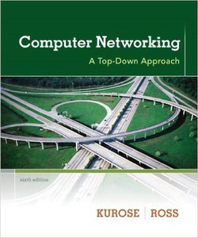](https://smile.amazon.com/Computer-Networking-Top-Down-Approach-7th/dp/0133594149/)

> **You can’t gaze in the crystal ball and see the future. What the
> Internet is going to be in the future is what society makes it.**
>
> — Bob Kahn

Given that so much of software engineering is on web servers and
clients, one of the most immediately valuable areas of computer science
is computer networking. Our self-taught students who methodically study
networking find that they finally understand terms, concepts and
protocols they’d been surrounded by for years.

Our favorite book on the topic is
*[Computer Networking: A Top-Down Approach](https://smile.amazon.com/Computer-Networking-Top-Down-Approach-7th/dp/0133594149/)*.
The small projects and exercises in the book are well worth doing, and
we particularly like the “Wireshark labs”, which they have
[generously provided online](http://www-net.cs.umass.edu/wireshark-labs/).

For those who prefer video lectures, we suggest Stanford’s
[*Introduction to Computer Networking course*](https://www.youtube.com/playlist?list=PLoCMsyE1cvdWKsLVyf6cPwCLDIZnOj0NS)
previously available via Stanford's MOOC platform Lagunita, but sadly
now only available as unofficial playlists on Youtube.

### Databases

[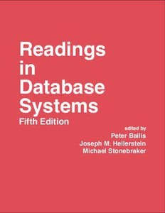](http://www.redbook.io/)
[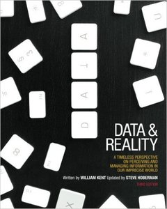](https://www.amazon.com/Data-Reality-Perspective-Perceiving-Information/dp/1935504215)

It takes more work to self-learn about database systems than it does
with most other topics. It’s a relatively new (i.e. post 1970s) field of
study with strong commercial incentives for ideas to stay behind closed
doors. Additionally, many potentially excellent textbook authors have
preferred to join or start companies instead.

Given the circumstances, we encourage self-learners to generally avoid
textbooks and start with [recordings of CS 186](https://www.youtube.com/user/CS186Berkeley/videos),
Joe Hellerstein’s databases course at Berkeley, and to progress to reading
papers after.

One paper particularly worth mentioning for new students is
“[Architecture of a Database System](http://db.cs.berkeley.edu/papers/fntdb07-architecture.pdf)”,
which uniquely provides a high-level view of how relational database
management systems (RDBMS) work. This will serve as a useful skeleton
for further study.

*Readings in Database Systems*, better known as
[the databases “Red Book”](http://www.redbook.io/),
is a collection of papers compiled and
edited by Peter Bailis, Joe Hellerstein and Michael Stonebraker. For
those who have progressed beyond the level of the CS 186 content, the
Red Book should be your next stop.

If you're adamant about using an introductory textbook, we suggest
*[Database Management Systems](https://smile.amazon.com/Database-Management-Systems-Raghu-Ramakrishnan/dp/0072465638/)*
by Ramakrishnan and Gehrke. For more advanced students, Jim Gray’s classic
*[Transaction Processing: Concepts and Techniques](https://www.amazon.com/Transaction-Processing-Concepts-Techniques-Management/dp/1558601902)*
is worthwhile, but we don’t encourage using this as a first resource.

Finally, data modeling is a neglected and poorly taught aspect of
working with databases. Our suggested book on the topic is
*[Data and Reality: A Timeless Perspective on Perceiving and Managing Information in Our Imprecise World](https://www.amazon.com/Data-Reality-Perspective-Perceiving-Information/dp/1935504215)*.

### Languages and Compilers

[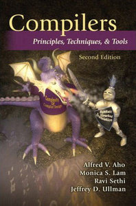](https://smile.amazon.com/Compilers-Principles-Techniques-Tools-2nd/dp/0321486811)

> **Don’t be a boilerplate programmer. Instead, build tools for users and
> other programmers. Take historical note of textile and steel
> industries: do you want to build machines and tools, or do you want to
> operate those machines?**
>
> — Ras Bodik at the start of his compilers course

Most programmers learn languages, whereas most computer scientists learn
*about* languages. This gives the computer scientist a distinct
advantage over the programmer, even in the domain of programming! Their
knowledge generalizes; they are able to understand the operation of a
new language more deeply and quickly than those who have merely learned
specific languages.

Our suggested introductory text is the excellent
*[Crafting Interpreters](https://craftinginterpreters.com/contents.html)*
by Bob Nystrom, available for free online. It's well organized, highly
entertaining, and well suited to those whose primary goal is simply to
better understand their languages and language tools. We suggest taking
the time to work through the whole thing, attempting whichever of the
"challenges" sustain your interest.

A more traditional recommendation is
*[Compilers: Principles, Techniques & Tools](https://smile.amazon.com/Compilers-Principles-Techniques-Tools-2nd/dp/0321486811)*,
commonly called “the Dragon Book”. Unfortunately, it’s not designed for
self-study, but rather for instructors to pick out 1-2 semesters worth
of topics for their courses.

If you elect to use the Dragon Book, it’s almost essential that you
cherry-pick the topics, ideally with the help of a mentor. In fact, our
suggested way to utilize the Dragon Book, if you so choose, is as a
supplementary reference for a video lecture series. Our recommended one
is [Alex Aiken’s, on edX](https://www.edx.org/course/compilers).

### Distributed Systems

[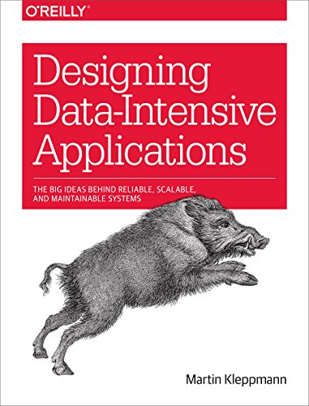](https://smile.amazon.com/Designing-Data-Intensive-Applications-Reliable-Maintainable-ebook/dp/B06XPJML5D/)

As computers have increased in number, they have also *spread*. Whereas
businesses would previously purchase larger and larger mainframes, it’s
typical now for even very small applications to run across multiple
machines. Distributed systems is the study of how to reason about the
trade-offs involved in doing so.

Our suggested book for self-study is Martin Kleppmann's
*[Designing Data-Intensive Applications](https://smile.amazon.com/Designing-Data-Intensive-Applications-Reliable-Maintainable-ebook/dp/B06XPJML5D/)*.
Far better than a traditional textbook, DDIA is a highly readable book
designed for practitioners, which somehow avoids sacrificing depth or
rigor.

For those seeking a more traditional text, or who would prefer one
that’s available for free online, we suggest Maarten van Steen and
Andrew Tanenbaum’s
*[Distributed Systems, 3rd Edition](https://www.distributed-systems.net/index.php/books/ds3/)*.

For those who prefer video, an excellent course with videos available
online is
[MIT’s 6.824](https://www.youtube.com/watch?v=cQP8WApzIQQ&list=PLrw6a1wE39_tb2fErI4-WkMbsvGQk9_UB),
a graduate course taught by Robert Morris with readings available
[here](https://pdos.csail.mit.edu/6.824/schedule.html).

No matter the choice of textbook or other secondary resources, study of
distributed systems absolutely mandates reading papers. A good list is
[here](http://dsrg.pdos.csail.mit.edu/papers/), and we would highly
encourage attending your local [Papers We
Love](http://paperswelove.org/) chapter.

## Frequently asked questions

#### Who is the target audience for this guide?

We have in mind that you are a self-taught software engineer, bootcamp
grad or precocious high school student, or a college student looking to
supplement your formal education with some self-study. The question of
when to embark upon this journey is an entirely personal one, but most
people tend to benefit from having some professional experience before
diving too deep into CS theory. For instance, we notice that students
*love* learning about database systems if they have already worked with
databases professionally, or about computer networking if they’ve worked
on a web project or two.

#### What about AI/graphics/pet-topic-X?

We’ve tried to limit our list to computer science topics that we feel
*every practicing software engineer* should know, irrespective of
specialty or industry, but with a focus on systems. In our experience,
these will be the highest ROI topics for the overwhelming majority of
self-taught engineers and bootcamp grads, and provide a solid foundation
for further study. Subsequently, you’ll be in a much better position to
pick up textbooks or papers and learn the core concepts without much
guidance. Here are our suggested starting points for a couple of common
“electives”:

- For artificial intelligence: do
  [Berkeley’s intro to AI course](http://ai.berkeley.edu/)
  by watching the videos and completing
  the excellent Pacman projects. As a textbook, use Russell and Norvig’s
  *Artificial Intelligence: A Modern Approach*.
- For machine learning: do Andrew Ng’s Coursera course. Be patient, and
  make sure you understand the fundamentals before racing off to shiny
  new topics like deep learning.
- For computer graphics: work through
  [Berkeley’s CS 184](http://inst.eecs.berkeley.edu/~cs184/fa12/onlinelectures.html)
  material, and use
  [Computer Graphics: Principles and Practice](https://www.amazon.com/Computer-Graphics-Principles-Practice-3rd/dp/0321399528)
  as a textbook.

#### How strict is the suggested sequencing?

Realistically, all of these subjects have a significant amount of
overlap, and refer to one another cyclically. Take for instance the
relationship between discrete math and algorithms: learning math first
would help you analyze and understand your algorithms in greater depth,
but learning algorithms first would provide greater motivation and
context for discrete math. Ideally, you’d revisit both of these topics
many times throughout your career.

As such, our suggested sequencing is mostly there to help you *just get
started*… if you have a compelling reason to prefer a different
sequence, then go for it. The most significant “pre-requisites” in our
opinion are: computer architecture before operating systems or
databases, and networking and operating systems before distributed
systems.

#### How does this compare to Open Source Society or freeCodeCamp curricula?

When this guide was first written in 2016, the
[OSS guide](https://github.com/open-source-society/computer-science) had too
many subjects, suggested inferior resources for many of them, and
provided no rationale or guidance around why or what aspects of
particular courses are valuable. We strove to limit our list of courses
to those which you *really should know* as a software engineer,
irrespective of your specialty, and to help you understand why each
course is included. In the subsequent years, the OSS guide has improved,
but we still think that this one provides a clearer, more cohesive path.

freeCodeCamp is focused mostly on programming, not computer science. For
why you might want to learn computer science, see
[above](#why-learn-computer-science). If you are new to
programming, we suggest prioritizing that, and returning to this guide
in a year or two.

#### What about language X?

Learning a particular programming language is on a totally different
plane to learning about an area of computer science — learning a
language is much *easier* and much *less valuable*. If you already know
a couple of languages, we strongly suggest simply following our guide
and fitting language acquisition in the gaps, or leaving it for
afterwards. If you’ve learned programming well (such as through
*Structure and Interpretation of Computer Programs*), and especially if
you have learned compilers, it should take you little more than a
weekend to learn the essentials of a new language, after which you can
learn about the libraries/tooling/ecosystem on the job.

#### What about trendy technology X?

No single technology is important enough that learning to use it should
be a core part of your education. On the other hand, it’s great that
you’re excited to learn about that thing. The trick is to work backwards
from the particular technology to the underlying field or concept, and
learn that in depth before seeing how your trendy technology fits into
the bigger picture.

#### Why are you still recommending SICP?

Look, just try it. Some people find SICP mind blowing, a characteristic
shared by very few other books. If you don't like it, you can always try
something else and perhaps return to SICP later.

#### Why are you still recommending the Dragon book?

The Dragon book is still the most complete single resource for
compilers. It gets a bad rap, typically for overemphasizing certain
topics that are less fashionable to cover in detail these days, such as
parsing. The thing is, the book was never intended to be studied cover
to cover, only to provide enough material for an instructor to put
together a course. Similarly, a self-learner can choose their own
adventure through the book, or better yet follow the suggestions that
lecturers of public courses have made in their course outlines.

#### How can I get textbooks cheaply?

Many of the textbooks we suggest are freely available online, thanks to
the generosity of their authors. For those that aren’t, we suggest
buying used copies of older editions. As a general rule, if there has
been more than a couple of editions of a textbook, it’s quite likely
that an older edition is perfectly adequate. It’s certainly unlikely
that the newest version is 10x better than an older one, even if that’s
what the price difference is!

#### Who made this?

This guide was originally written by [Oz
Nova](https://twitter.com/oznova_) and [Myles
Byrne](https://twitter.com/quackingduck), with 2020 updates by Oz. It is
based on our experience teaching foundational computer science to over
1000 mostly self-taught engineers and bootcamp grads in small group
settings in San Francisco and live online. Thank you to all of our
students for your continued feedback on self-teaching resources.

We're very confident that you could teach yourself everything above,
given enough time and motivation. But if you'd prefer an intensive,
structured, instructor-led program, you might be interested in our
[Computer Science Intensive](https://bradfieldcs.com/csi/). We
[DON'T](https://ozwrites.com/masters/) suggest pursuing a master's
degree.

For updates to this guide and general computer science news and
resources, you may also like to join Bradfield's mailing list.

---

`hello@bradfieldcs.com`  
San Francisco, California  
© 2016-2020 Bradfield School of Computer Science
