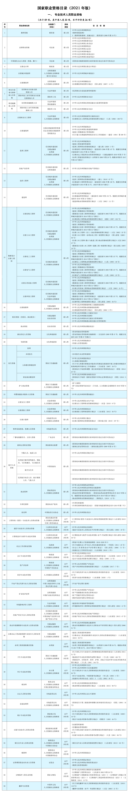

# 国家职业资格目录

## 2021年版《国家职业资格目录》

2021年版国家职业资格目录共计72项职业资格。
其中，专业技术人员职业资格59项，含准入类33项，水平评价类26项；技能人员职业资格13项。

目录中准入类职业资格关系公共利益或涉及国家安全、公共安全、人身健康、生命财产安全，均有法律法规或国务院决定作为依据；
水平评价类职业资格具有较强的专业性和社会通用性，技术技能要求较高，行业管理和人才队伍建设确实需要。

### PDF 版

<object data="/assets/pdf/P020211202354560821450.pdf" type="application/pdf" width="100%" height="500" >
    <embed src="/assets/pdf/P020211202354560821450.pdf" type="application/pdf" />
</object>

### 图片版

### 相关公告

> 根据国务院推进简政放权、放管结合、优化服务改革要求，人力资源社会保障部会同国务院有关部门对《国家职业资格目录》进行优化调整，形成了《国家职业资格目录（2021年版）》，经国务院同意，现予以公布。
>
> 特此公告。
>
> 附件：国家职业资格目录（2021年版）
>
> 人力资源社会保障部
>
> 2021年11月23日
>
> ---
>
> 解读
>
> - 人力资源社会保障部公布2021年版《国家职业资格目录》
> - 人力资源社会保障部有关司局负责同志就公布《国家职业资格目录（2021年版）》答记者问

- 人力资源社会保障部关于公布《国家职业资格目录（2021年版）》的公告，发布时间： 2021年11月23日
  - [:fontawesome-solid-paper-plane:][link-1]
  - [:fontawesome-solid-paper-plane:][link-2]

- 人力资源社会保障部关于公布国家职业资格目录的通知，发布时间： 2017年09月12日 【附件: 国家职业资格目录（共计140项）】
  - [:fontawesome-solid-paper-plane:][link-3]

[link-1]: http://www.mohrss.gov.cn/xxgk2020/fdzdgknr/zcfg/gfxwj/rcrs/202112/t20211202_429301.html
[link-2]: http://www.mohrss.gov.cn/SYrlzyhshbzb/SYgundongxinwen/201710/t20171024_280005.html
[link-3]: http://www.mohrss.gov.cn/xxgk2020/fdzdgknr/zcfg/gfxwj/rcrs/201709/t20170915_277385.html
